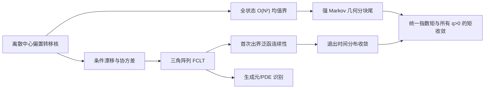

# 中心偏置弱漂移定理：外部概率论评审包

版本：2026-07-17  
状态：`ready_for_external_review`，尚未完成外部评审  
对象：未参与当前推导的概率论/随机过程研究者

## 1. 评审目的与决策合同

本评审不是一般性的“看看证明是否合理”，而是独立决定候选定理 T9 能否
以定理身份进入投稿稿件。评审者需要分别核查模型、过程极限、退出泛函、
统一尾界、矩收敛、PDE 识别与新颖性边界，最后作出以下一种决定：

- `accept`：结论与证明链可冻结，仅允许文字性修改；
- `minor revision`：主结论不变，但需补局部推导/精确定理引用；
- `major revision`：主思路可能成立，但当前存在实质缺口；
- `reject`：存在反例、错误尺度或无法修复的逻辑断裂；
- `not checked`：评审者未覆盖该项，不能被解释为通过。

任何关键项为 `major revision`、`reject` 或 `not checked` 时，项目文档中
T9 都必须保留“工作稿”标签，不得写成“已证明/已验证定理”。

## 2. 待评定理（冻结陈述）

固定 (k\ge2)、

\[
\Delta_{k-1}=\{y\in[0,\infty)^k:\sum_i y_i=k\},\qquad
y^{(N)}\to y\in\Delta_{k-1}^{\circ},
\]

并令中心偏置参数 (p_N=1+\eta/N)，其中 (eta\in\mathbb R) 固定。离散
链每步均匀选择一个无序节点对，并按中心偏置规则在该对内转移一个单位；
定义

\[
Y_N(t)=N^{-1}X_N(\lfloor N^2t\rfloor),\qquad
\tau_N=\inf\{n\ge0:\min_iX_{N,i}(n)=0\}.
\]

候选结论是

\[
Y_N\Rightarrow Y,
\qquad
\frac{\tau_N}{N^2}\Rightarrow T,
\qquad
\mathbb E\left(\frac{\tau_N}{N^2}\right)^q
\longrightarrow \mathbb ET^q
\quad(\forall q>0),
\]

其中 (Y) 是守恒超平面上的常系数带漂移扩散，(T) 是首次离开

\[
D=\{(y_1,\ldots,y_{k-1}):y_i>0,\ \sum_{i<k}y_i<k\}
\]

的时间。均值 (u(y)=\mathbb E_yT) 应在明确的弱解/连续黏性解框架下满足

\[
\mathcal Lu=-1\quad\text{in }D,\qquad u=0\quad\text{on }\partial D.
\]

完整符号、漂移与协方差计算见 [07 证明包](07_weak_drift_proof_package.md)；
已有内部攻击记录见 [08 对抗性审计](08_weak_drift_adversarial_audit.md)。

## 3. 输入材料与依赖图

评审材料：

- [研究事实正典](01_research_canon.md)
- [定理—缺口登记表](06_theorem_proof_gap_register.md)
- [弱漂移完整证明包](07_weak_drift_proof_package.md)
- [内部对抗性审计](08_weak_drift_adversarial_audit.md)
- [近临界/非对称文献审计](sources/near_critical_asymmetric_search_audit_2026-07-17.md)
- [模型实现](../../../drift_experiments.py)
- [单元测试](../../../test_drift.py)

## 4. 逐项签核表

评审者应在“决定”和“证据/页码”两列中亲自填写；空白等同 `not checked`。

| ID | 必须核查的命题 | 反例/压力测试 | 决定 | 证据、页码或修改要求 |
|---|---|---|---|---|
| R1 | 论文转移核、漂移公式、协方差与代码实现完全一致 | (k=2,3)；(p=0,1,2)；中心/外围方向互换 |  |  |
| R2 | 三角阵列 FCLT 的条件、时间尺度和退化守恒方向处理完整 | 检查 (p_N\in[0,2]) 的最终范围；检查协方差秩 (k-1) |  |  |
| R3 | 从 Skorokhod 过程收敛到首次出界时间收敛所需连续集已证明 | 路径切触边界、沿边界运行、离散阶梯延拓、初值趋近边界 |  |  |
| R4 | (eta=0) 的全状态 (O(N^2)) 均值界无可选停止漏洞 | 所有停止均写为 (	au\wedge m)，再取极限 |  |  |
| R5 | (eta>0) 与 (eta<0) 的统一均值界常数对所有内部状态有效 | 中心余额接近 0 或 (kN)；外围余额高度不均 |  |  |
| R6 | 强 Markov 分块论证确实给出统一几何尾 | 分块长度、条件概率和向上取整是否一致 |  |  |
| R7 | 几何尾足以推出一个统一指数矩，并进一步推出每个固定 (q>0) 的矩收敛 | 非整数 (q<1)、任意大固定 (q)、尾和积分交换 |  |  |
| R8 | 极限扩散从任意内部点几乎必然有限时退出，且 (T) 无原子/连续映射条件充分 | 漂移指向内部、退化法向、顶点和棱附近 |  |  |
| R9 | PDE 的生成元、边界条件和函数空间表述正确 | (H_0^1) 弱解与连续黏性解是否被混用；是否需要角点正则性 |  |  |
| R10 | 初始序列 \(y^{(N)}\to y\) 的取整/总和约束没有隐藏假设 | \(Ny\) 非整数；总容量必须等于 \(kN\) |  |  |
| R11 | (k=2)、(eta=0) 与已知赌徒破产/Brownian 结果一致 | 比较均值、扩散系数和 PDE 常数 |  |  |
| R12 | 该结论未被已核验先例直接覆盖 | 独立读 Barnett 1964；核查 Tzioufas 2019 与 Phetpradap 2025 的可推广性 |  |  |

## 5. 必答的对抗性问题

1. 如果把中心编号从 1 改为任意 (c)，漂移/协方差公式是否仅作坐标置换？
2. FCLT 的引用定理是否真的允许随 (N) 变化的增量分布，还是证明中暗用了
   固定分布 Donsker 定理？
3. 离散链可能一步正好落到边界；所用路径插值和退出泛函是否与
   (	au_N/N^2) 精确对应，误差是否为 (O(N^{-2}))？
4. “统一 (O(N^2)) 均值”是否覆盖每一个内部状态，还是只覆盖均分初值？若
   只覆盖后者，几何分块尾证明即不成立。
5. 从几何尾到统一指数矩时，指数参数是否可取为独立于 (N) 的正数？
6. 极限域是开单纯形，扩散只在 (k-1) 维切空间非退化；PDE 是否错误地在
   (\mathbb R^k) 中使用退化椭圆算子？
7. 是否存在 Barnett (1964) 或其后续引用已经包含三人成对非对称转账的
   近临界特例？即使只覆盖 (k=3)，正文贡献措辞也必须调整。
8. 是否有某个一般三角阵列退出定理可以直接推出全部结论？若有，应把 T9
   改写为该定理在中心偏置 PCN 模型中的推论，而不是宣称方法新颖。

## 6. 降级规则

| 失败位置 | 必须采取的降级 |
|---|---|
| R1/R2 失败 | 暂停全部弱漂移主张，先修正模型或尺度 |
| R3/R8 失败 | 只保留过程收敛，不陈述退出时间收敛 |
| R4–R7 任一失败 | 只保留分布收敛；期望/全矩结论全部删除或改为猜想 |
| R9 失败 | 删除 PDE 唯一性/正则性表述，只保留概率表示，直至补证 |
| R10/R11 失败 | 修改定理假设并重新跑边界一致性测试 |
| R12 找到直接先例 | T9 改为应用推论；论文贡献转向 PCN 映射、强漂移相图和计算代理 |

## 7. 评审者最终交付

外部复核完成的最低交付不是一句“看起来没问题”，而是：

1. 带页码/公式号批注的 07 证明包；
2. 填满 R1–R12 的签核表；
3. 一页定理决定书：可冻结陈述、必须修改项、反例边界；
4. 精确到定理编号的 FCLT/连续映射/PDE 引用建议；
5. 对 Barnett (1964) 的四项同构判据判定与最近先例声明。

评审者：__________  所属机构/研究方向：__________  日期：__________

总体决定：`accept / minor revision / major revision / reject`

签名或可追溯电子确认：________________________________

## 8. 当前项目方声明

截至 2026-07-17，R1–R11 仅完成项目内部推导与对抗性审计，R12 仍受
Barnett (1964) 全文缺失限制。本文件的存在不代表外部评审已经发生；在收到
完整签核前，T9 的标准状态仍为“证明链闭合的内部工作稿”。
