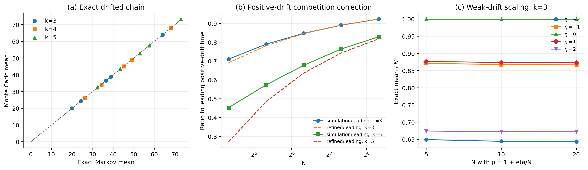

# \(k\geq3\) 含漂移超边停止时间：严格模型、精确方程与渐近公式

## 结论先行

对于 \(k\geq3\)，仅给出一个标量“漂移因子”并不能唯一决定停止时间。必须先说明每个有序交易方向 \(i\to j\) 的概率。对任意合法流量矩阵 \(\Pi=(\pi_{ij})\)，停止时间的准确答案是单纯形上的离散 Poisson 方程；一般不存在只依赖 \((k,C,\sigma,p_{\mathrm{bias}})\) 的通用初等闭式。

本文给出两层结果：

1. **完全一般且精确的结果**：任意 \(\Pi\) 下的 Markov 方程
   \[
   u(\mathbf x)
   =1+\sum_{i\ne j}\pi_{ij}
   u(\mathbf x-\mathbf e_i+\mathbf e_j),
   \qquad u|_{\partial\mathcal S}=0.
   \]
2. **与旧文档原意最接近的合法一参数模型**：节点 0 为中心偏置节点，
   \(p_{\mathrm{bias}}\in[0,2]\)。该模型可严格导出漂移向量、协方差、
   精确递推、弱漂移扩散 PDE，以及固定强漂移的相对指数集中和全矩极限；
   正漂移竞争修正目前仍是待证明的二阶近似。

最重要的新结论是：正负漂移不对称。

- \(p_{\mathrm{bias}}<1\)：只有节点 0 具有负漂移；
- \(p_{\mathrm{bias}}>1\)：有 \(k-1\) 个外围节点同时具有负漂移。

因此，任何只通过 \(|p_{\mathrm{bias}}-1|\) 构造的对称校正函数，都不能在一般 \(k\) 下同时准确描述两侧。

---

## 1. 一般流量矩阵模型

### 1.1 余额过程

考虑一个包含 \(k\geq3\) 个参与者的多方支付通道。余额向量为

\[
\mathbf B(t)=(B_0(t),\ldots,B_{k-1}(t)),
\qquad
\sum_{i=0}^{k-1}B_i(t)=C.
\]

固定每笔交易金额为 \(\sigma>0\)。第 \(t\) 笔交易选择付款方 \(i\) 和收款方 \(j\)，其中

\[
\Pr(S_t=i,D_t=j)=\pi_{ij},
\qquad i\ne j,
\]

\[
\pi_{ij}\geq0,
\qquad
\sum_{i\ne j}\pi_{ij}=1.
\]

交易后的余额为

\[
\mathbf B(t+1)
=\mathbf B(t)+\sigma(\mathbf e_j-\mathbf e_i).
\]

定义首次余额耗尽时间

\[
\tau
=\inf\left\{t\geq0:\min_iB_i(t)=0\right\}.
\]

这里的时间单位是“该超边内发生的交易笔数”。停止事件是首次方向性余额耗尽，不等同于协议层面的通道永久关闭。

### 1.2 漂移向量

一步增量为

\[
\boldsymbol\xi_t
=\sigma(\mathbf e_{D_t}-\mathbf e_{S_t}).
\]

节点 \(i\) 的漂移为

\[
\mu_i
=\mathbb E[\xi_{t,i}]
=\sigma\left(
\sum_{j\ne i}\pi_{ji}
-\sum_{j\ne i}\pi_{ij}
\right).
\]

向量形式为

\[
\boxed{
\boldsymbol\mu
=\sigma\sum_{i\ne j}\pi_{ij}(\mathbf e_j-\mathbf e_i).
}
\]

由于每笔交易守恒资金，必有

\[
\mathbf1^\top\boldsymbol\mu=0.
\]

但这不意味着每个 \(\mu_i\) 都等于零。一个标量漂移因子只有在同时规定如何生成整个 \(\Pi\) 后才有数学意义。

### 1.3 协方差

一步增量协方差为

\[
\boxed{
\Gamma
=\sigma^2\sum_{i\ne j}\pi_{ij}
(\mathbf e_j-\mathbf e_i)(\mathbf e_j-\mathbf e_i)^\top
-\boldsymbol\mu\boldsymbol\mu^\top.
}
\]

严格地说，最后一项应理解为用货币单位漂移构成的外积；等价地，若 \(\mathbf d=\boldsymbol\mu/\sigma\)，则

\[
\Gamma
=\sigma^2\left[
\sum_{i\ne j}\pi_{ij}
(\mathbf e_j-\mathbf e_i)(\mathbf e_j-\mathbf e_i)^\top
-\mathbf d\mathbf d^\top
\right].
\]

---

## 2. 任意漂移下的精确停止时间方程

假设所有余额都是 \(\sigma\) 的整数倍，令

\[
X_i(t)=\frac{B_i(t)}\sigma,
\qquad
M=\frac C\sigma.
\]

内部状态空间为

\[
\mathcal S_M^\circ
=\left\{
\mathbf x\in\mathbb Z_{\geq1}^k:
\sum_i x_i=M
\right\}.
\]

令

\[
u(\mathbf x)=\mathbb E_{\mathbf x}\tau.
\]

对第一步条件化，得到

\[
\boxed{
u(\mathbf x)
=1+
\sum_{i\ne j}\pi_{ij}
u(\mathbf x-\mathbf e_i+\mathbf e_j),
\qquad \mathbf x\in\mathcal S_M^\circ.
}
\]

边界条件为

\[
\boxed{
u(\mathbf x)=0,
\qquad \min_i x_i=0.
}
\]

若一次转移使某个余额从 1 变为 0，则对应的下一状态直接使用边界值 0。

枚举内部状态后可写为

\[
\boxed{
(I-Q)\mathbf u=\mathbf1.
}
\]

还需要说明该线性系统确实存在唯一有限解。任选一个满足
\(\pi_{ab}=\rho>0\) 的有序方向，并令

\[
L=M-k+1.
\]

从任意内部状态出发，连续选择方向 \(a\to b\) 至多 \(L\) 次就会使
节点 \(a\) 的余额降为零。因此每个长度为 \(L\) 的时间块内，吸收概率
至少为 \(\rho^L>0\)，从而

\[
\Pr_{\mathbf x}(\tau>nL)
\leq(1-\rho^L)^n.
\]

这同时证明 \(\tau<\infty\) 几乎必然、\(\mathbb E_{\mathbf x}\tau<\infty\)、
\(Q\) 的谱半径小于 1，以及

\[
\boxed{\mathbf u=(I-Q)^{-1}\mathbf1}
\]

是唯一有限解。这是给定离散模型的精确答案，不是近似。对于小中等
\(k\) 和容量，可以用稀疏线性系统得到机器精度下的期望停止时间。

---

## 3. 合法的一参数中心偏置模型

下面给出一个与旧文档“节点 0 正/负漂移”意图一致、但不存在负概率的模型。

记

\[
p=p_{\mathrm{bias}},
\qquad 0\leq p\leq2,
\qquad \delta=p-1.
\]

每笔交易先从全部 \(\binom{k}{2}\) 个无序节点对中均匀选择一对。

- 若选中 \(\{0,r\}\)，则以概率 \(p/2\) 从 \(r\) 向 0 转账，以概率 \((2-p)/2\) 从 0 向 \(r\) 转账；
- 若选中两个外围节点 \(\{r,s\}\)，两个方向各取概率 \(1/2\)。

于是 \(p=1\) 表示完全无偏，\(p<1\) 表示节点 0 净流出，\(p>1\) 表示节点 0 净流入。

### 3.1 单节点增量概率

节点 0 的增量分布是

\[
\Pr(\Delta X_0=+1)=\frac pk,
\]

\[
\Pr(\Delta X_0=-1)=\frac{2-p}{k},
\]

\[
\Pr(\Delta X_0=0)=1-\frac2k.
\]

因此，条件于节点 0 本轮活跃，余额增加概率为

\[
\Pr(\Delta X_0=+1\mid0\text{ 活跃})=\frac p2.
\]

任一外围节点 \(r\geq1\) 的增量分布为

\[
\Pr(\Delta X_r=+1)
=\frac{k-p}{k(k-1)},
\]

\[
\Pr(\Delta X_r=-1)
=\frac{k-2+p}{k(k-1)},
\]

\[
\Pr(\Delta X_r=0)=1-\frac2k.
\]

条件于外围节点活跃，余额增加概率为

\[
\Pr(\Delta X_r=+1\mid r\text{ 活跃})
=\frac{k-p}{2(k-1)}.
\]

这正是旧推导试图表达的“有效概率”，但现在它来自一个完整、合法的联合交易模型。

旧文档中 \(p/k\) 与 \((1-p)/k\) 的写法不正确；当 \(p>1\) 时后者为负。节点 0 的正确减小概率是

\[
\boxed{\frac{2-p}{k}},
\]

不是 \((1-p)/k\)。

### 3.2 漂移向量

在整数余额单位下，节点 0 的每笔交易平均增量是

\[
d_0
=\frac pk-\frac{2-p}{k}
=\frac{2\delta}{k}.
\]

每个外围节点的平均增量是

\[
d_r
=\frac{k-p}{k(k-1)}
-\frac{k-2+p}{k(k-1)}
=-\frac{2\delta}{k(k-1)}.
\]

因此

\[
\boxed{
\mathbf d
=\left(
\frac{2\delta}{k},
-\frac{2\delta}{k(k-1)},\ldots,
-\frac{2\delta}{k(k-1)}
\right),
}
\]

\[
\boxed{
\boldsymbol\mu=\sigma\mathbf d.
}
\]

容易检查 \(\sum_i d_i=0\)。

### 3.3 协方差矩阵

无论交易方向如何，同一无序节点对的增量外积相同。因此第二原始矩不受 \(p\) 影响：

\[
\mathbb E[\Delta\mathbf X\Delta\mathbf X^\top]
=\frac{2}{k-1}
\left(I-\frac1k\mathbf1\mathbf1^\top\right).
\]

所以

\[
\boxed{
\operatorname{Cov}(\Delta\mathbf X)
=\frac{2}{k-1}
\left(I-\frac1k\mathbf1\mathbf1^\top\right)
-\mathbf d\mathbf d^\top.
}
\]

货币余额的一步协方差为上述矩阵乘以 \(\sigma^2\)。

---

## 4. 中心偏置模型的精确递推

记

\[
q_{\mathrm{pair}}=\frac{2}{k(k-1)},
\qquad
\theta=\frac p2.
\]

对任意内部状态 \(\mathbf x\)，精确递推为

\[
\boxed{
\begin{aligned}
u(\mathbf x)=1
&+q_{\mathrm{pair}}
\sum_{r=1}^{k-1}
\bigg[
\theta\,
u(\mathbf x+\mathbf e_0-\mathbf e_r)
+(1-\theta)
u(\mathbf x-\mathbf e_0+\mathbf e_r)
\bigg]
\\
&+\frac{q_{\mathrm{pair}}}{2}
\sum_{1\leq r<s\leq k-1}
\bigg[
u(\mathbf x+\mathbf e_r-\mathbf e_s)
+u(\mathbf x-\mathbf e_r+\mathbf e_s)
\bigg].
\end{aligned}
}
\]

边界仍为 \(u=0\)。这就是本文推荐作为理论基准和数值 ground truth 的公式。

节点 0 与外围节点角色不同，但外围节点彼此可置换。因此可以把状态压缩为

\[
(x_0,\operatorname{sort}(x_1,\ldots,x_{k-1})),
\]

显著减少线性系统规模，而且不改变均分初始状态的精确结果。

---

## 5. 漂移下的平方势函数恒等式

定义

\[
V(\mathbf B)
=\sum_i\left(B_i-\frac Ck\right)^2.
\]

一次 \(i\to j\) 交易给出

\[
\Delta V
=2\sigma(B_j-B_i)+2\sigma^2.
\]

对一般流量矩阵取条件期望：

\[
\boxed{
\mathbb E[\Delta V\mid\mathcal F_t]
=2\sigma^2
+2\left(
\mathbf B(t)-\frac Ck\mathbf1
\right)^\top\boldsymbol\mu.
}
\]

停止后可选停止得到精确占用恒等式

\[
\boxed{
\begin{aligned}
\mathbb E V(\mathbf B(\tau))-V(\mathbf B(0))
=2\sigma^2\mathbb E\tau
+2\mathbb E\sum_{t=0}^{\tau-1}
\left(
\mathbf B(t)-\frac Ck\mathbf1
\right)^\top\boldsymbol\mu.
\end{aligned}
}
\]

零漂移时第二项消失，才恢复先前的简单鞅界。含漂移时不能继续直接使用零漂移下界作为“所有漂移都成立”的结论。

---

## 6. 任意容量下的严格路径界和漂移上界

假设初始均分

\[
X_i(0)=N,
\qquad N=\frac{C}{k\sigma}.
\]

任何节点至少需要累计 \(N\) 次净减小才能到零，而一笔交易最多使一个余额减小 1，所以

\[
\boxed{\tau\geq N\quad\text{几乎必然}.}
\]

从而

\[
\boxed{\mathbb E\tau\geq N.}
\]

对每个节点，

\[
X_i(t)-d_it
\]

是鞅。在 \(\tau\) 停止后

\[
\mathbb E X_i(\tau)=N+d_i\mathbb E\tau.
\]

若 \(d_i<0\)，利用 \(X_i(\tau)\geq0\)，得到

\[
\mathbb E\tau\leq\frac{N}{|d_i|}.
\]

于是中心偏置模型有严格界：

### 6.1 负漂移 \(p<1\)

只有节点 0 漂移为负，故

\[
\boxed{
N\leq\mathbb E\tau
\leq\frac{kN}{2(1-p)}
=\frac{C}{2\sigma(1-p)}.
}
\]

### 6.2 正漂移 \(p>1\)

每个外围节点漂移为负，故

\[
\boxed{
N\leq\mathbb E\tau
\leq\frac{k(k-1)N}{2(p-1)}
=\frac{(k-1)C}{2\sigma(p-1)}.
}
\]

这些上界同时是强漂移极限的首阶时间尺度。

---

## 7. 大容量形式扩散近似

当 \(N=C/(k\sigma)\) 较大时，对精确离散方程作二阶 Taylor 展开。令 \(u(\mathbf b)\) 表示从货币余额 \(\mathbf b\) 出发的期望停止时间，则

\[
\boxed{
\boldsymbol\mu^\top\nabla u
+\frac12\operatorname{tr}
\left(\Gamma\nabla^2u\right)
=-1,
}
\]

定义域和边界为

\[
\mathbf b\in
\left\{
\mathbf b\geq0:\sum_i b_i=C
\right\},
\qquad
u|_{\min_i b_i=0}=0.
\]

这是由生成元二阶展开得到的单纯形对流—扩散 Poisson 方程。它保留
完整漂移向量和节点相关性，是比“最弱节点投影 + 有效上界拟合”更有
结构依据的连续近似；但仅有 Taylor 展开还不能证明离散退出时间期望
收敛，严格极限仍需处理边界、退出时间映射和一致可积性。

---

## 8. 弱漂移极限（内部对抗性复核完成，待外部独立核查）

若 \(p-1\) 固定且 \(N\to\infty\)，漂移会压过扩散，停止时间从 \(N^2\) 量级变为 \(N\) 量级。要得到漂移与扩散同时存在的非退化极限，应令

\[
\delta_N=p-1=\frac\eta N,
\]

其中 \(\eta\) 固定。

定义缩放过程

\[
\mathbf Z^{(N)}(s)
=\frac1N\mathbf X(\lfloor N^2s\rfloor).
\]

极限漂移为

\[
\boldsymbol\beta_\eta
=\left(
\frac{2\eta}{k},
-\frac{2\eta}{k(k-1)},\ldots,
-\frac{2\eta}{k(k-1)}
\right).
\]

极限生成元为

\[
\mathcal A_\eta
=\boldsymbol\beta_\eta^\top\nabla
+\frac1{k-1}\Delta_{\mathrm{tan}}.
\]

形式极限的期望停止时间 \(a_\eta(\mathbf z)\) 应满足

\[
\boxed{
\boldsymbol\beta_\eta^\top\nabla a_\eta
+\frac1{k-1}\Delta_{\mathrm{tan}}a_\eta
=-1,
\qquad
a_\eta|_{\partial\mathcal S}=0.
}
\]

从均分点出发，渐近定理工作稿为

\[
\boxed{
\mathbb E\tau
=N^2a_{k}(\eta)+o(N^2).
}
\]

\(a_k(\eta)\) 是 PDE 在 \((1,\ldots,1)\) 处的值。除少数特殊情形外，它需要数值求解，不应伪装成未经证明的初等闭式。

完整证明见
[弱漂移退出时间极限证明包](outputs/researchwrite/hypergraph-stopping-time/07_weak_drift_proof_package.md)。
其四个闭合环节是：

1. 增量均值为 \(\boldsymbol\beta_\eta/N\)，协方差趋于
   \(A_0=2(I-\mathbf1\mathbf1^\top/k)/(k-1)\)；有界三角阵列不变原理
   给出切向 Brownian 运动加常漂移的过程极限。
2. 固定时域上的生存事件由有限个坐标运行最小值决定；每个坐标的极限
   是方差 \(2/k>0\) 的一维带漂移 Brownian 运动，其运行最小值无原子，
   因而首次出界时间收敛。
3. 对所有内部初态建立统一 \(AN^2\) 均值界：\(\eta=0\) 用平方势函数，
   \(\eta>0\) 用任一外围负漂移坐标，\(\eta<0\) 用中心负漂移坐标。
   强 Markov 分块随后给出
   \[
   \sup_{\mathbf x}\Pr_{\mathbf x}
   \{\tau_N>m\lceil2AN^2\rceil\}\le2^{-m},
   \]
   且 \(L_N/N^2\le2A+1\)，从而给出统一指数矩；对任意固定 \(q>0\)，
   \[
   \mathbb E(\tau_N/N^2)^q\longrightarrow\mathbb ET^q.
   \]
4. 极限协方差在切向子空间正定，Dynkin/Feynman–Kac 把期望退出时间
   识别为上式 Dirichlet–Poisson 问题的唯一 \(H_0^1\) 变分弱解；
   比较原理另给出唯一连续黏性解。只声称内部经典正则性，不声称角点处
   \(C^2\) 光滑。

因此本节的状态从“形式命题”升级为“证明链闭合并完成内部对抗性审计的
定理工作稿”。逐环节审计见
[弱漂移内部对抗性审计](outputs/researchwrite/hypergraph-stopping-time/08_weak_drift_adversarial_audit.md)。
投稿前仍需由未参与推导的概率论研究者外部逐行核查，并补入所用不变
原理和 PDE 结果的精确定理编号。还须明确：公平随机选对多人模型已有
Sobel–Frankowski（2002）直接先例；三人和四人 Brownian/simplex 路线
分别已有 Alabert 等（2004）、Denisov–Wachtel（2024）以及
O’Connor–Saloff-Coste（2023）的先例。候选差异点是固定一般 \(k\) 的
中心偏置近临界全矩极限，而非公平模型或 \(k=3,4\) 基线。

正确的漂移强度判据应依赖 \(N\)，而不是旧文档中的 \(|p-1|<k/4\)。可用 Péclet 数判断：

\[
\mathrm{Pe}_0
\approx N|p-1|
\quad\text{（中心节点）},
\]

\[
\mathrm{Pe}_{\mathrm{per}}
\approx\frac{N|p-1|}{k-1}
\quad\text{（外围节点）}.
\]

- \(\mathrm{Pe}\ll1\)：近零漂移、\(N^2\) 时间尺度；
- \(\mathrm{Pe}=O(1)\)：使用弱漂移 PDE；
- \(\mathrm{Pe}\gg1\)：使用强漂移渐近式。

### 多项式消失漂移的统一相图

令

\[
p_N=1+\eta N^{-\alpha},
\qquad \eta\ne0,\quad \alpha\ge0.
\]

则 \(\mathrm{Pe}_N=|\eta|N^{1-\alpha}\)，现有弱、强漂移证明可以统一为：

| 区间 | 时间尺度 | 停止时间极限 |
|---|---:|---|
| \(0\le\alpha<1\) | \(N^{1+\alpha}\) | 缩放停止时间以 \(e^{-cN^{1-\alpha}}\) 相对集中于正负不对称常数，且全部固定正阶矩收敛 |
| \(\alpha=1\) | \(N^2\) | 带漂移 Brownian 单纯形退出及全部固定正阶矩收敛 |
| \(\alpha>1\) | \(N^2\) | 漂移在首阶消失，回到公平 Brownian 单纯形退出及全部固定正阶矩收敛 |

其中 \(\alpha>1\) 的关键新步骤是对平方势函数证明全状态一步期望增量
最终一致为正，从而得到统一 \(O(N^2)\) 均值界和指数矩。完整证明及
外部复核清单见
[多项式消失漂移相图证明包](outputs/researchwrite/hypergraph-stopping-time/11_polynomial_drift_phase_diagram_proof_package.md)。
这仍是内部工作稿；一维 \(1/N\) 弱不对称和小漂移转变已有先例，不能把
临界尺度本身写成原创发现。

---

## 9. 强漂移集中与矩渐近

以下令 \(k\) 固定、\(p\ne1\) 固定并令 \(N\to\infty\)。

本节原先只闭合了均值首阶式。现已通过自由延拓、最大型
Azuma–Hoeffding 早尾界、单负漂移坐标晚尾界与统一指数矩，将结论加强为：
对下文对应的 \(t_N^*\) 和任意固定 \(\varepsilon\in(0,1)\)，存在
\(c=c(k,p,\varepsilon)>0\)，使充分大 \(N\) 下

\[
\Pr\!\left(\left|\frac{\tau_N}{t_N^*}-1\right|>\varepsilon\right)
\le (k+1)e^{-cN},
\]

并且对每个固定 \(q>0\)，

\[
\mathbb E\left(\frac{\tau_N}{t_N^*}\right)^q\longrightarrow1.
\]

特别地，下列均值首阶式是这个更强定理的推论。完整逐步证明、指数矩
论证、边界条件和 12 项外部复核清单见
[固定强漂移退出时间证明包](outputs/researchwrite/hypergraph-stopping-time/10_strong_drift_proof_package.md)。
当前状态是内部闭合工作稿，尚未通过独立概率论核查。

### 9.1 负漂移：中心节点唯一主导

当 \(p<1\) 时，节点 0 的负漂移速度为

\[
v_0=\frac{2(1-p)}k.
\]

从初始距离 \(N\) 到达零的确定性时间为

\[
t_-^*=\frac N{v_0}
=\frac{kN}{2(1-p)}.
\]

外围节点具有正漂移。为使用标准鞅集中不等式，在同一独立交易方向序列上
把余额随机游走形式地延拓到 \(\tau\) 之后；该延拓不改变首次到零事件。
令

\[
M_i(t)=X_i(t)-N-d_it.
\]

则 \(M_i\) 是鞅，且其一步差分绝对值有统一常数上界。对任意固定
\(\varepsilon\in(0,1)\)，令

\[
t_{-,\varepsilon}=\left\lfloor(1-\varepsilon)t_-^*\right\rfloor.
\]

在 \(s\leq t_{-,\varepsilon}\) 时，中心节点的确定性均值至少为
\(\varepsilon N\)，每个外围节点的确定性均值至少为 \(N\)。若此时已经
停止，则至少一个坐标鞅发生了量级为 \(N\) 的向下偏离。最大型
Azuma–Hoeffding 不等式和对固定 \(k\) 的并集界给出

\[
\Pr(\tau<t_{-,\varepsilon})\leq k\exp[-c_-(k,p,\varepsilon)N]
\]

其中 \(c_->0\)。结合第 6 节的严格上界
\(\mathbb E\tau\leq t_-^*\)，有

\[
t_{-,\varepsilon}\Pr(\tau\geq t_{-,\varepsilon})
\leq\mathbb E\tau\leq t_-^*.
\]

先令 \(N\to\infty\)，再令 \(\varepsilon\downarrow0\)，得到

\[
\boxed{
\mathbb E\tau
=\frac{kN}{2(1-p)}[1+o(1)]
=\frac{C}{2\sigma(1-p)}[1+o(1)].
}
\]

该首阶表达式同时是第 6 节的严格上界。

### 9.2 正漂移：\(k-1\) 个外围节点竞争

当 \(p>1\) 时，每个外围节点的负漂移速度为

\[
v_r=\frac{2(p-1)}{k(k-1)}.
\]

若只看确定性路径，所有外围节点同时在

\[
t_+^*
=\frac N{v_r}
=\frac{k(k-1)N}{2(p-1)}
\]

到达零。与负漂移情形相同，对

\[
t_{+,\varepsilon}=\left\lfloor(1-\varepsilon)t_+^*\right\rfloor
\]

应用最大型 Azuma–Hoeffding 不等式：在此之前，每个外围节点的确定性
均值至少为 \(\varepsilon N\)，中心节点的确定性均值至少为 \(N\)。因此

\[
\Pr(\tau<t_{+,\varepsilon})
\leq k\exp[-c_+(k,p,\varepsilon)N]
\]

其中 \(c_+>0\)。再结合第 6 节的
\(\mathbb E\tau\leq t_+^*\)，可严格得到首阶极限

\[
\boxed{
\mathbb E\tau
=\frac{k(k-1)N}{2(p-1)}[1+o(1)].
}
\]

但有限 \(N\) 时，\(k-1\) 个负漂移节点竞争，最小停止时间会显著小于 \(t_+^*\)。这正是单一“最弱节点”近似容易系统性高估的原因。

### 9.3 正漂移的候选竞争修正（待证）

令

\[
m=k-1,
\qquad
\kappa_m
=\mathbb E\max_{1\leq r\leq m}Z_r,
\quad Z_r\overset{\mathrm{iid}}\sim N(0,1).
\]

它可由一维积分计算：

\[
\kappa_m
=\int_0^\infty
\left[
1-\Phi(x)^m-(1-\Phi(x))^m
\right]dx.
\]

外围节点在 \(t_+^*\) 附近的高斯波动具有等方差、等协方差。若对角元记为 \(\gamma\)、非对角元记为 \(c\)，由第 3.3 节可得一个重要消去：

\[
\gamma-c=\frac{2}{k-1}.
\]

若对相关随机游走的联合首次到达时间使用 delta-method，并假设余项在
取最小值和期望后仍为 \(o(\sqrt N)\)，则得到候选展开

\[
\boxed{
\mathbb E\tau
=t_+^*
\left[
1-\kappa_{k-1}
\sqrt{\frac{k}{(p-1)N}}
+o(N^{-1/2})
\right].
}
\]

这比只使用 \(t_+^*\) 更准确，并明确体现外围节点数量造成的极值竞争。

这里的 \(N^{-1/2}\) 系数具有明确的协方差来源，但当前尚未证明联合首次
到达时间的强近似、过冲控制和期望余项。因此该式目前是有数值支持的
形式二阶渐近式，而不是已完成证明的渐近定理。

该修正式只在

\[
\kappa_{k-1}\sqrt{\frac{k}{(p-1)N}}\ll1
\]

时使用。如果括号内修正不小，应该回到精确 Markov 方程或对流—扩散 PDE，不能强行套用渐近展开。

---

## 10. 为什么不能沿用对称经验校正函数

旧文档提出的形式大致为

\[
h(p,k)=\exp[-\alpha(k)|p-1|^{\gamma(k)}].
\]

即使重新拟合参数，它仍存在结构问题：

1. 负漂移由一个中心节点主导，正漂移由 \(k-1\) 个外围节点竞争；两侧不对称。
2. 强漂移首阶时间分别为
   \[
   t_-^*=\frac{kN}{2(1-p)},
   \qquad
   t_+^*=\frac{k(k-1)N}{2(p-1)},
   \]
   相差结构因子 \(k-1\)。
3. 正漂移还存在 \(\kappa_{k-1}\sqrt{k/[(p-1)N]}\) 的极值修正，不能只由 \(|p-1|\) 表示。
4. 漂移适用区间取决于 \(N(p-1)\)，旧条件 \(|p-1|<k/4\) 缺少容量尺度，而且当 \(p\in[0,2]\)、\(k\geq4\) 时几乎自动成立，不能判断扩散近似是否有效。
5. 将多个相关余额过程投影成一个赌徒破产过程，需要额外证明；经验有效上界只能称为拟合参数，不能称为定理。

因此推荐用“精确 Markov 方程 + 弱漂移 PDE + 强漂移渐近式”替换 v5/v6 的单一经验闭式。

---

## 11. 数值验证

验证程序见 [drift_experiments.py](drift_experiments.py)。

### 11.1 精确 Markov 方程与 Monte Carlo

实验覆盖

\[
k\in\{3,4,5\},
\quad N=8,
\quad p\in\{0.4,0.7,1.0,1.3,1.6\},
\]

每个场景进行 30,000 次独立仿真。

| 指标 | 结果 |
|---|---:|
| 场景数 | 15 |
| 精确值与 Monte Carlo 最大相对差 | 0.547% |
| 该 15 个场景的线性系统最大绝对残差 | \(8.88\times10^{-14}\) |

部分结果：

| \(k\) | \(N\) | \(p\) | Markov 精确值 | Monte Carlo | 95% 区间 | 相对差 |
|---:|---:|---:|---:|---:|---:|---:|
| 3 | 8 | 0.4 | 19.9034 | 19.9019 | [19.8137, 19.9902] | 0.007% |
| 3 | 8 | 1.0 | 64.0000 | 63.9075 | [63.3985, 64.4165] | 0.145% |
| 3 | 8 | 1.6 | 24.2020 | 24.2418 | [24.1385, 24.3450] | 0.164% |
| 4 | 8 | 0.7 | 45.1650 | 45.0891 | [44.8181, 45.3600] | 0.168% |
| 4 | 8 | 1.3 | 48.9165 | 48.7410 | [48.4577, 49.0242] | 0.359% |
| 5 | 8 | 1.6 | 43.3636 | 43.4086 | [43.2119, 43.6054] | 0.104% |

### 11.2 强负漂移公式

在 \(k=3,5\)、\(N=20\sim320\)、\(p=0.5\) 的实验中，公式

\[
\frac{kN}{2(1-p)}
\]

与 Monte Carlo 的最大相对差为 0.322%。这与“唯一负漂移中心节点主导”的理论一致。

### 11.3 强正漂移竞争修正

当 \(p=1.5\) 时，只使用首阶 \(t_+^*\) 会明显高估有限容量停止时间。加入竞争修正后的结果为：

| \(k\) | \(N\) | Monte Carlo | 首阶公式误差 | 竞争修正误差 |
|---:|---:|---:|---:|---:|
| 3 | 20 | 85.23 | 40.8% | 2.72% |
| 3 | 80 | 406.62 | 18.0% | 0.19% |
| 3 | 320 | 1772.00 | 8.35% | 0.02% |
| 5 | 80 | 1083.94 | 47.6% | 6.11% |
| 5 | 160 | 2444.51 | 30.9% | 2.78% |
| 5 | 320 | 5305.04 | 20.6% | 1.31% |

这说明修正式的误差随 \(N\) 增大而收敛，但 \(k\) 较大、\(N(p-1)/(k-1)\) 不够大时仍应使用精确方程。

### 11.4 弱漂移 \(p=1+\eta/N\)

下表给出 \(N=20\) 的精确 Markov 结果 \(\mathbb E\tau/N^2\)：

| \(k\) | \(\eta=-2\) | \(\eta=-1\) | \(\eta=0\) | \(\eta=1\) | \(\eta=2\) |
|---:|---:|---:|---:|---:|---:|
| 3 | 0.6431 | 0.8669 | 1.0000 | 0.8733 | 0.6719 |
| 4 | 0.7776 | 0.9688 | 1.0635 | 0.9777 | 0.8218 |

结果随 \(N=5,10,20\) 已基本稳定，支持第 8 节的 \(N^2a_k(\eta)\) 弱漂移缩放；同时正负 \(\eta\) 的数值并不完全相同，再次说明对称 \(|p-1|\) 校正缺少理论依据。

原始结果：

- [精确 Markov 验证](results/drift-exact-validation.csv)
- [强漂移渐近验证](results/drift-strong-asymptotic.csv)
- [弱漂移缩放](results/drift-weak-scaling.csv)

---

## 12. 论文中建议采用的公式体系

### 定理：精确离散方程

对给定合法 \(\Pi\)，使用

\[
(I-Q)\mathbf u=\mathbf1,
\qquad u|_{\partial\mathcal S}=0.
\]

这是主定理和小规模 ground truth。

### 命题：中心偏置模型的漂移与协方差

使用第 3.2、3.3 节的 \(\mathbf d\) 与协方差矩阵；这些是逐步直接计算得到的精确公式。

### 定理：漂移上界

使用第 6 节的

\[
\mathbb E\tau\leq\frac{kN}{2(1-p)}
\quad(p<1),
\]

\[
\mathbb E\tau\leq\frac{k(k-1)N}{2(p-1)}
\quad(p>1).
\]

### 渐近定理工作稿：弱漂移

在 \(p=1+\eta/N\)、固定 \(k\)、\(N\to\infty\) 下，使用第 8 节已经
闭合并完成内部对抗性复核的单纯形对流—扩散退出与全矩极限；待外部
独立核查后冻结为论文定理。

### 渐近定理：强漂移首阶

在固定 \(p\ne1\)、固定 \(k\)、\(N\to\infty\) 下，使用第 9.1、9.2 节
由漂移上界和最大型 Azuma–Hoeffding 集中界得到的首阶式。

### 待证二阶命题：正漂移竞争修正

第 9.3 节的 \(N^{-1/2}\) 修正保留为待证命题和经验比较对象，直至联合
首次到达强近似与 \(o(\sqrt N)\) 期望余项得到证明。

不建议再把经验 \(h(p,k)\)、\(b_{\mathrm{eff}}\) 或拟合误差包络称为定理。它们若继续保留，应明确标为“经验回归基线”，并与精确 Markov 解在留出参数域上比较。
