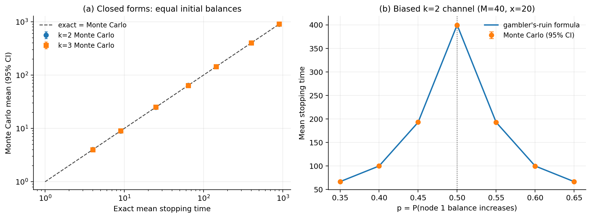
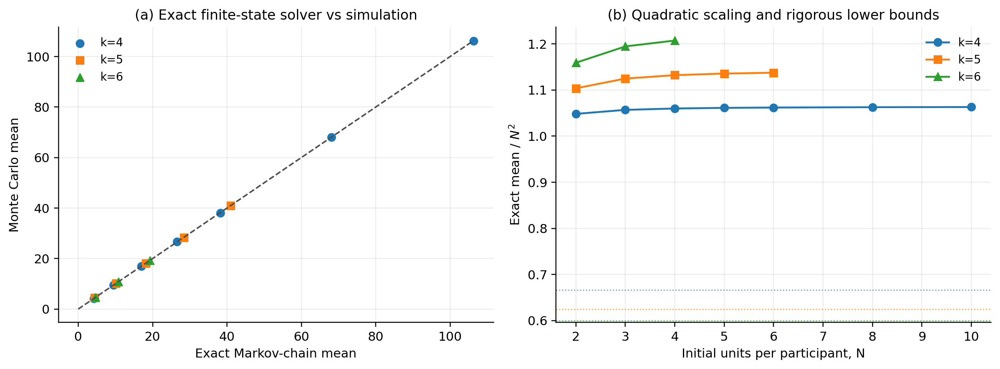
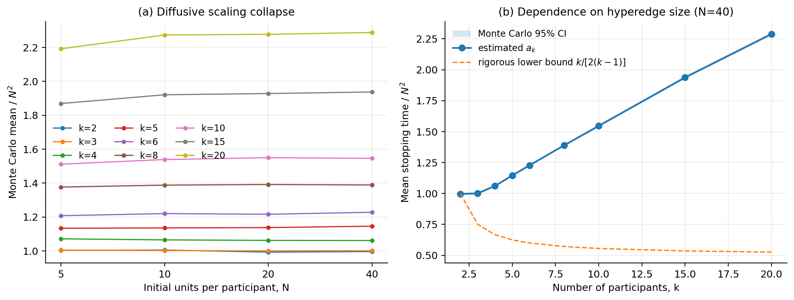
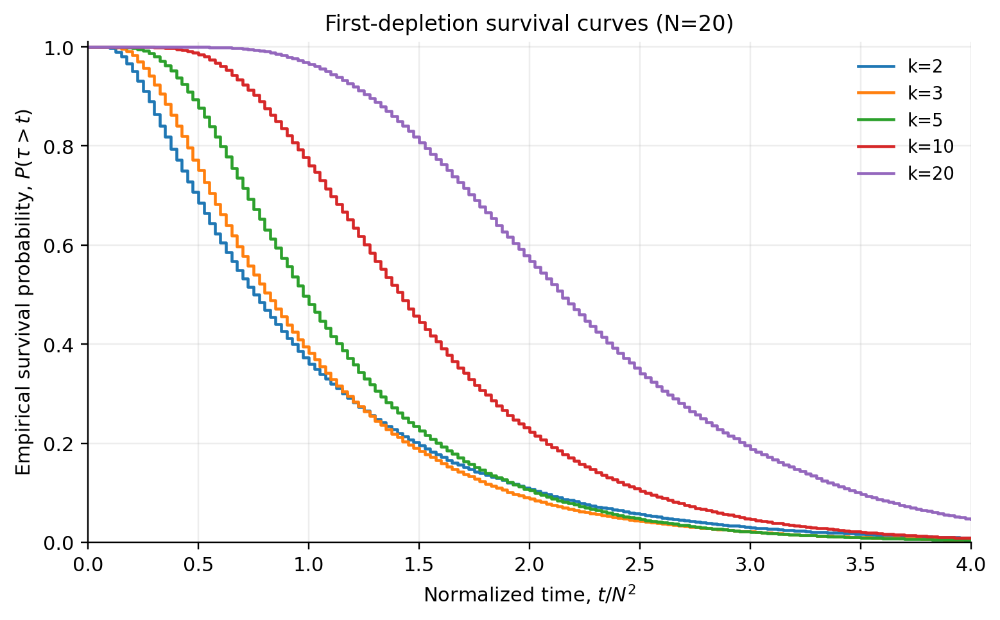
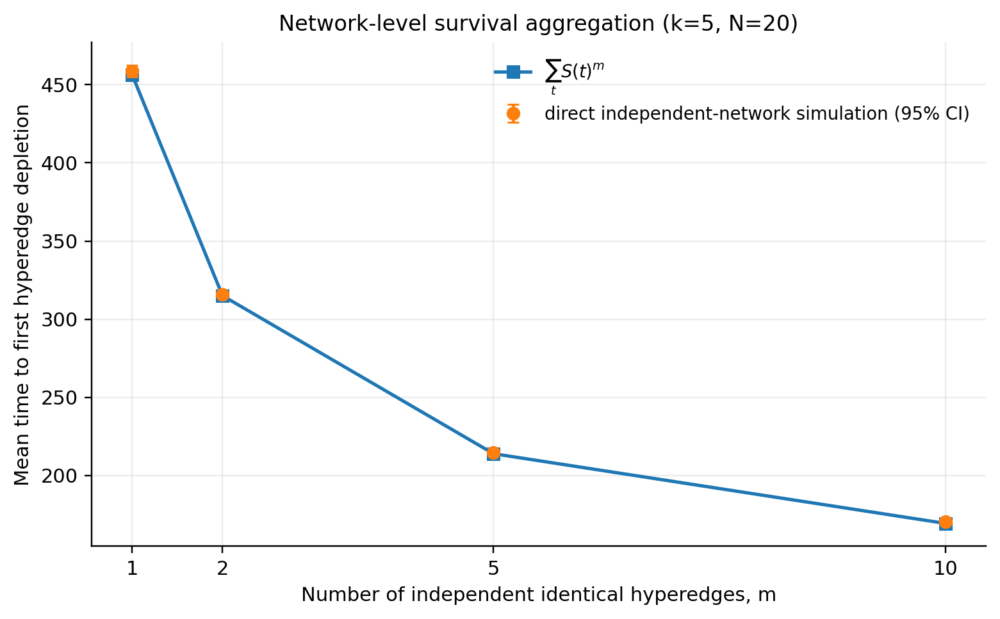

# 超图支付通道首次余额耗尽时间：严格推导与仿真验证

## 摘要

本文从一个明确、可验证的随机过程出发，研究单个多方支付通道（超边）中首次有参与者余额降为零的时间。这里的“停止”是**首次方向性余额耗尽**，不等同于协议层面的通道永久死亡；余额为零的参与者仍可能接收后续资金。

在固定交易额、端点均匀选择、总容量守恒的基准模型下，本文得到：

1. 二方通道的赌徒破产精确解；均分且无漂移时
   \[
   \mathbb E\tau=\frac{C^2}{4\sigma^2}.
   \]
2. 复现三方公平模型的已知精确解；任意正初始余额 \(B_1,B_2,B_3\) 下
   \[
   \mathbb E\tau=\frac{3B_1B_2B_3}{C\sigma^2},
   \]
   均分时同样为 \(C^2/(9\sigma^2)\)。
3. 任意 \(k\) 的精确离散 Poisson 方程、鞅恒等式，以及均分初始余额下的严格界
   \[
   \frac{C^2}{2k(k-1)\sigma^2}
   \leq \mathbb E\tau \leq
   \frac{C^2(k-1)}{2k\sigma^2}.
   \]
4. 对固定 \(k\) 的公平模型，现有弱漂移证明包在 \(\eta=0\) 时给出
   \(N^2\) 缩放、退出时间及全部固定正阶矩收敛，并识别单纯形 Poisson
   方程；该证明链已完成内部对抗性复核，但仍待外部独立概率论核查。
   公平随机选对模型、三人和四人情形均已有直接文献先例。
5. 多超边相互独立时，网络首次超边耗尽时间应通过生存函数相乘聚合，不能只由各超边期望值聚合。

所有闭式公式均用 Monte Carlo 验证；小规模一般 \(k\) 还使用吸收 Markov 链作无抽样噪声的精确基准。完整实验的闭式解最大相对差为 0.782%，Markov 精确解最大相对差为 0.792%，精确线性系统最大残差为 \(4.97\times10^{-14}\)。这些差异是有限 Monte Carlo 样本误差，不是解析公式的拟合误差。

---

## 1. 模型、时间尺度与停止事件

### 1.1 单个超边

设超边包含 \(k\geq2\) 个参与者，时刻 \(t\) 的余额向量为

\[
\mathbf B(t)=(B_1(t),\ldots,B_k(t)),
\qquad B_i(t)\geq0,
\qquad \sum_{i=1}^k B_i(t)=C.
\]

总容量 \(C\) 始终守恒。每笔交易金额固定为 \(\sigma>0\)，并从全部 \(k(k-1)\) 个有序端点对中均匀选择付款方 \(S_t=i\) 和收款方 \(D_t=j\)：

\[
\Pr(S_t=i,D_t=j)=\frac1{k(k-1)},\qquad i\ne j.
\]

一次成功交易的状态更新是

\[
\mathbf B(t+1)
=\mathbf B(t)+\sigma(\mathbf e_j-\mathbf e_i).
\]

本文使用“超边本地交易笔数”作为离散时间：每发生一笔该超边内的交易，\(t\) 增加 1。

### 1.2 首次余额耗尽时间

定义

\[
\tau=\inf\{t\geq0:\min_i B_i(t)=0\}.
\]

停止前所有余额至少为 \(\sigma\)，所以每笔被抽中的固定额交易均可执行；使付款方从 \(\sigma\) 变为零的交易正是吸收步骤。因此基准模型不需要额外定义“余额不足时拒绝交易”的规则。

为得到有限状态链，假设余额是 \(\sigma\) 的整数倍。令

\[
X_i(t)=\frac{B_i(t)}{\sigma},
\qquad M=\frac C\sigma,
\]

则 \(X_i\) 是非负整数、\(\sum_iX_i=M\)。均分初始余额时记

\[
X_i(0)=N,
\qquad M=kN,
\qquad N=\frac{C}{k\sigma}.
\]

状态空间不是超立方体，而是整数单纯形

\[
\mathcal S_M=\{\mathbf x\in\mathbb Z_{\geq0}^k:\sum_i x_i=M\}.
\]

---

## 2. 一步生成元、漂移与协方差

对任意函数 \(f\)，离散生成元为

\[
(\mathcal Lf)(\mathbf b)
=\frac1{k(k-1)}
\sum_{i\ne j}
\left[
f\bigl(\mathbf b+\sigma(\mathbf e_j-\mathbf e_i)\bigr)-f(\mathbf b)
\right].
\]

令一步增量 \(\boldsymbol\xi=\sigma(\mathbf e_j-\mathbf e_i)\)。均匀端点选择给出

\[
\mathbb E\boldsymbol\xi=\mathbf0.
\]

其协方差的对角元和非对角元分别为

\[
\operatorname{Var}(\xi_i)=\frac{2\sigma^2}{k},
\qquad
\operatorname{Cov}(\xi_i,\xi_j)
=-\frac{2\sigma^2}{k(k-1)},\quad i\ne j.
\]

写成矩阵为

\[
\Sigma
=\frac{2\sigma^2}{k-1}
\left(I-\frac1k\mathbf1\mathbf1^\top\right).
\]

矩阵在 \(\mathbf1\) 方向上的特征值为零，反映总容量守恒；随机运动实际发生在 \(k-1\) 维超平面上。

更一般地，若有序端点概率为 \(\pi_{ij}\)，则漂移向量是

\[
\boldsymbol\mu
=\sigma\sum_{i\ne j}\pi_{ij}(\mathbf e_j-\mathbf e_i).
\]

平衡流量的正确条件是 \(\boldsymbol\mu=\mathbf0\)，即每个节点的流入概率等于流出概率；总容量守恒本身并不意味着零漂移。

---

## 3. \(k=2\)：赌徒破产精确解

设 \(X_1(t)=x\)，则 \(X_2(t)=M-x\)。令

\[
p=\Pr(X_1\text{ 增加 }1),
\qquad q=1-p.
\]

记从位置 \(x\) 出发的期望停止时间为 \(u_x\)。边界和递推关系为

\[
u_0=u_M=0,
\]

\[
u_x=1+pu_{x+1}+qu_{x-1},
\qquad 1\leq x\leq M-1.
\]

### 3.1 无漂移

当 \(p=q=1/2\) 时，二阶差分方程为

\[
u_{x+1}-2u_x+u_{x-1}=-2.
\]

满足两个零边界的解是

\[
\boxed{u_x=x(M-x)}.
\]

若初始均分，\(x=M/2=C/(2\sigma)\)，则

\[
\boxed{
\mathbb E\tau
=\frac{C^2}{4\sigma^2}
=N^2.
}
\]

### 3.2 有漂移

当 \(p\ne q\) 时，齐次方程的两个基本解为 \(1\) 与 \((q/p)^x\)。代入边界可得

\[
\boxed{
u_x
=\frac{x}{q-p}
-\frac{M}{q-p}
\frac{1-(q/p)^x}{1-(q/p)^M}.
}
\]

此处 \(p\) 必须是 \((0,1)\) 内的真实概率。不能把取值范围为 \((0,2)\) 的“偏置参数”直接代入概率表达式。

---

## 4. \(k=3\)：均匀流量下的已知精确基线

这一模型和公式不是本项目首次提出。Engel（1993）已处理三塔问题，
Bruss、Louchard 和 Turner（2003）给出同一精确均值并研究其分布与高维
推广；Alabert、Farré 和 Roy（2004）进一步建立了对应三角格随机游走与
Brownian 三角形退出时间的联系。本文保留以下复推，是为了固定符号、
验证精确求解器，并作为高维/含漂移结果的解析基线。

- https://www.jstor.org/stable/2324818
- https://doi.org/10.1239/aap/1046366109
- https://doi.org/10.1007/s00245-003-0779-1

令整数余额为 \((x,y,z)\)，且 \(x+y+z=M\)。取乘积势函数

\[
P(x,y,z)=xyz.
\]

考虑同一无序节点对的两个方向。例如 \(1\to2\) 与 \(2\to1\) 对乘积造成的总变化为

\[
[(x-1)(y+1)-xy]z
+[(x+1)(y-1)-xy]z
=-2z.
\]

三个无序节点对相加，再除以六个等概率有序方向，得到

\[
(\mathcal LP)(x,y,z)
=-\frac{x+y+z}{3}
=-\frac M3.
\]

因此

\[
P(\mathbf X(t\wedge\tau))
+\frac M3(t\wedge\tau)
\]

是鞅。第 5 节的上界保证 \(\mathbb E\tau<\infty\)，所以可选停止后，利用边界上 \(P(\mathbf X(\tau))=0\)，得到

\[
xyz=\frac M3\mathbb E_{x,y,z}\tau.
\]

于是

\[
\boxed{
\mathbb E_{x,y,z}\tau
=\frac{3xyz}{M}.
}
\]

换回货币余额：

\[
\boxed{
\mathbb E\tau
=\frac{3B_1(0)B_2(0)B_3(0)}{C\sigma^2}.
}
\]

均分时 \(B_i(0)=C/3\)，所以

\[
\boxed{
\mathbb E\tau
=\frac{C^2}{9\sigma^2}
=N^2.
}
\]

这个闭式解依赖均匀有序端点选择；它不能未经证明地推广到任意非均匀流量矩阵。

---

## 5. 任意 \(k\)：鞅恒等式和严格上下界

定义相对均分状态的平方偏差

\[
V(\mathbf B)
=\sum_{i=1}^k\left(B_i-\frac Ck\right)^2.
\]

当一笔交易从 \(i\) 向 \(j\) 转移 \(\sigma\) 时，直接展开平方得到

\[
\Delta V
=2\sigma(B_j-B_i)+2\sigma^2.
\]

对全部有序端点对均匀平均后，第一项为零，因此

\[
\mathbb E[\Delta V\mid\mathcal F_t]=2\sigma^2.
\]

故

\[
V(\mathbf B(t\wedge\tau))-2\sigma^2(t\wedge\tau)
\]

是鞅。单纯形是有界的，所以先对 \(t\wedge\tau\) 使用可选停止，再令 \(t\to\infty\)，可得精确恒等式

\[
\boxed{
\mathbb E\tau
=\frac{\mathbb E V(\mathbf B(\tau))-V(\mathbf B(0))}{2\sigma^2}.
}
\]

均分初始余额时 \(V(\mathbf B(0))=0\)。边界上至少一个余额为零。

### 5.1 边界势函数的最小值

在一个余额为零、其他余额总和为 \(C\) 的条件下，凸性说明其余 \(k-1\) 个余额相等时 \(V\) 最小：

\[
V_{\min,\partial}
=\frac{C^2}{k(k-1)}.
\]

### 5.2 整个单纯形上势函数的最大值

凸函数在单纯形顶点取最大值。若一个节点持有全部 \(C\)、其余为零，则

\[
V_{\max}
=\frac{C^2(k-1)}k.
\]

因此均分初始余额下

\[
\boxed{
\frac{C^2}{2k(k-1)\sigma^2}
\leq\mathbb E\tau\leq
\frac{C^2(k-1)}{2k\sigma^2}.
}
\]

用 \(C=kN\sigma\) 表示：

\[
\boxed{
\frac{k}{2(k-1)}N^2
\leq\mathbb E\tau\leq
\frac{k(k-1)}2N^2.
}
\]

下界在 \(k=2\) 时正好等于精确解。上述鞅恒等式和界也适用于固定步长、任意满足 \(\boldsymbol\mu=0\) 的端点概率矩阵；但三方乘积闭式解仍需要更强的均匀性。

---

## 6. 任意 \(k\) 的精确有限状态解

令 \(u(\mathbf x)=\mathbb E_{\mathbf x}\tau\)。对所有内部整数状态 \(x_i\geq1\)，一步分析给出

\[
\boxed{
u(\mathbf x)
=1+\frac1{k(k-1)}
\sum_{i\ne j}
u(\mathbf x-\mathbf e_i+\mathbf e_j),
}
\]

其中若下一状态有一个坐标为零，则使用边界值

\[
u(\mathbf x)=0,
\qquad\min_i x_i=0.
\]

枚举内部状态后，上式就是吸收 Markov 链的离散 Poisson 方程

\[
\boxed{(I-Q)\mathbf u=\mathbf1}.
\]

这不是近似公式。只要线性系统被准确求解，它就是给定离散模型的精确数值期望。均匀流量对参与者标签置换不变，所以本实验把互为排列的余额向量合并成一个排序状态；这是强可聚合的对称性约简，不改变均分初始状态的答案。

---

## 7. 大容量扩散极限（内部复核完成，待外部独立核查）

令

\[
Z_i^{(N)}(s)=\frac{X_i(\lfloor N^2s\rfloor)}N,
\qquad \sum_i Z_i^{(N)}=k.
\]

一步长度为 \(1/N\)，时间加速为 \(N^2\)。由第 2 节协方差，候选极限
扩散在超平面 \(\sum_i z_i=k\) 上的生成元为

\[
\mathcal A
=\frac1{k-1}\Delta_{\mathrm{tan}},
\]

其中 \(\Delta_{\mathrm{tan}}\) 是该超平面上的切向 Laplace 算子。令 \(a(\mathbf z)\) 为极限扩散的期望出界时间，则

\[
\boxed{
\frac1{k-1}\Delta_{\mathrm{tan}}a(\mathbf z)=-1,
\qquad
a|_{\partial\mathcal S}=0.
}
\]

从均分点 \(\mathbf1=(1,\ldots,1)\) 出发，记

\[
a_k=a(\mathbf1).
\]

对公平模型，固定 \(k\) 并令 \(N\to\infty\)，当前证明工作稿给出

\[
\boxed{
\mathbb E\tau=N^2a_k+o(N^2).
}
\]

这里 \(a_2=a_3=1\)。对 \(k\geq4\)，本文不声称存在未经证明的简单闭式；应通过离散 Markov 方程、PDE 数值法或 Monte Carlo 得到 \(a_k\)。

完整论证写入
[弱漂移退出时间极限证明包](outputs/researchwrite/hypergraph-stopping-time/07_weak_drift_proof_package.md)：

1. 有界增量三角阵列 FCLT 给出切向 Brownian 极限；
2. 单纯形有限个面的法向投影均为非退化一维 Brownian 运动，运行最小值
   无原子，从而给出首次出界的连续集；
3. 平方势函数对所有内部初态给出统一 \(O(N^2)\) 均值界，再用强 Markov
   性质分块得到几何尾与统一指数矩，因而对每个固定 \(q>0\) 有
   \(\mathbb E(\tau_N/N^2)^q\to\mathbb ET^q\)；
4. Dynkin/Feynman–Kac 表示识别唯一 \(H_0^1\) 变分弱解；比较原理另
   给出唯一连续黏性解，避免混用解概念。

因此本节已从“形式生成元 + 数值支持”升级为“证明链闭合并完成内部
对抗性审计的定理工作稿”。逐环节审计见
[弱漂移内部对抗性审计](outputs/researchwrite/hypergraph-stopping-time/08_weak_drift_adversarial_audit.md)。
它仍须由未参与推导的概率论研究者外部独立核查，并补入所用不变原理与
PDE 结果的精确定理编号；在完成该质量门前不应写成“已发表定理”。
此外，Sobel–Frankowski（2002）已覆盖公平随机选对模型，
O’Connor–Saloff-Coste（2023）已研究同一公平四人首次破产模型，
Denisov–Wachtel（2024）已给出三人 harmonic-measure/Brownian 近似
速率。本项目候选差异点被收窄为固定一般 \(k\) 的中心偏置近临界全矩
极限与强漂移相图，而不是公平模型或 Brownian 路线本身。

---

## 8. 网络级首次停止时间

设网络中第 \(e\) 条超边的首次余额耗尽时间为 \(\tau_e\)，网络首次超边耗尽时间定义为

\[
T_{\mathrm{first}}=\min_e\tau_e.
\]

对于非负整数时间随机变量，有尾和公式

\[
\mathbb ET_{\mathrm{first}}
=\sum_{t=0}^{\infty}\Pr(T_{\mathrm{first}}>t).
\]

只有在各超边停止时间相互独立时，才有

\[
\Pr(T_{\mathrm{first}}>t)
=\prod_eS_e(t),
\qquad
S_e(t)=\Pr(\tau_e>t),
\]

从而

\[
\boxed{
\mathbb ET_{\mathrm{first}}
=\sum_{t=0}^{\infty}\prod_eS_e(t).
}
\]

对于 \(m\) 条独立同分布超边，公式化为

\[
\mathbb ET_{\mathrm{first}}
=\sum_{t=0}^{\infty}S(t)^m.
\]

共享节点、共享路由支付或共同流量冲击会破坏独立性；此时必须求联合生存概率或进行耦合网络仿真，不能继续使用生存函数乘积。

---

## 9. 实验设计

所有实验由 [run_experiments.py](run_experiments.py) 生成，随机种子由 \((k,N,\text{实验编号})\) 确定，因而可复现。

| 实验 | 参数 | 重复次数 | 验证对象 |
|---|---|---:|---|
| 闭式解 | \(k=2,3\)，\(N=2,3,5,8,12,20,30\) | 每点 50,000 | \(k=2,3\) 精确公式 |
| 二方漂移 | \(M=40,x=20,p=0.35\sim0.65\) | 每点 50,000 | 有偏赌徒破产公式 |
| 精确 Markov | \(k=4,5,6\)，小中等 \(N\) | 每点 30,000 | \((I-Q)u=1\) |
| 缩放与界 | \(k=2\sim20,N=5,10,20,40\) | 每点 20,000 | \(N^2\) 缩放、严格界、鞅恒等式 |
| 网络聚合 | \(k=5,N=20,m=1,2,5,10\) | 基准 50,000；直接网络每点 20,000 | \(\sum_tS(t)^m\) |

Monte Carlo 均值使用样本标准差 \(s\) 给出大样本 95% 置信区间：

\[
\bar\tau\pm1.95996\frac{s}{\sqrt n}.
\]

本实验的最小样本量为 20,000，停止时间虽偏斜，但均值的中心极限定理近似在该规模下足够稳定。CSV 中同时保留样本标准差，便于改用 bootstrap 复核。

---

## 10. 实验结果

### 10.1 总体数值核验

| 核验指标 | 结果 |
|---|---:|
| \(k=2,3\) 闭式解最大相对差 | 0.782% |
| 有偏 \(k=2\) 公式最大相对差 | 0.321% |
| \(k=4,5,6\) Markov 精确解最大相对差 | 0.792% |
| 29 个精确值落入对应 Monte Carlo 95% 区间 | 27（93.1%） |
| 线性系统最大绝对残差 | \(4.97\times10^{-14}\) |
| 鞅恒等式经验最大相对差 | 1.103% |
| 网络生存函数聚合最大相对差 | 0.668% |
| 95% 区间整体落在严格界错误一侧的场景数 | 0 |

若 29 个区间各自具有约 95% 覆盖率，出现约 1 至 2 个未覆盖点是正常抽样现象；本实验出现 2 个。相对差会随 Monte Carlo 样本量增加按约 \(n^{-1/2}\) 缩小，而线性系统残差已经接近双精度浮点误差量级。



### 10.2 小规模一般 \(k\) 的精确 Markov 基准

| \(k\) | \(N\) | 完整内部状态数 | 对称约简状态数 | 精确均值 | Monte Carlo 均值 | 95% 区间 | 相对差 |
|---:|---:|---:|---:|---:|---:|---:|---:|
| 4 | 10 | 9,139 | 478 | 106.3099 | 106.1385 | [105.3708, 106.9061] | 0.161% |
| 5 | 6 | 23,751 | 377 | 40.9526 | 40.9580 | [40.6852, 41.2307] | 0.013% |
| 6 | 4 | 33,649 | 199 | 19.3172 | 19.3038 | [19.1838, 19.4238] | 0.070% |



### 10.3 \(N^2\) 缩放和超边规模效应

下表列出 \(N=40\) 时的经验缩放常数 \(\widehat a_k=\bar\tau/N^2\)。对 \(k=2,3\)，理论值为 1；其他数值是当前参数下的 Monte Carlo 估计，不应冒充闭式常数。

| \(k\) | \(\bar\tau\) | 95% 区间 | \(\widehat a_k\) | 严格下界 \(k/[2(k-1)]\) |
|---:|---:|---:|---:|---:|
| 2 | 1593.87 | [1576.02, 1611.73] | 0.9962 | 1.0000 |
| 3 | 1601.31 | [1585.54, 1617.09] | 1.0008 | 0.7500 |
| 4 | 1697.58 | [1682.61, 1712.56] | 1.0610 | 0.6667 |
| 5 | 1833.00 | [1817.86, 1848.13] | 1.1456 | 0.6250 |
| 6 | 1964.58 | [1949.30, 1979.86] | 1.2279 | 0.6000 |
| 8 | 2222.17 | [2206.54, 2237.80] | 1.3889 | 0.5714 |
| 10 | 2473.39 | [2457.11, 2489.67] | 1.5459 | 0.5556 |
| 15 | 3100.36 | [3082.18, 3118.54] | 1.9377 | 0.5357 |
| 20 | 3661.70 | [3641.85, 3681.55] | 2.2886 | 0.5263 |

图中 \(N=5,10,20,40\) 的 \(\mathbb E\tau/N^2\) 已基本重合，支持扩散尺度 \(N^2\)。\(k\) 增大时按“全超边交易笔数”计量的停止时间上升，原因是每个指定节点每笔交易被选为端点的概率仅为 \(2/k\)；这不与“参与者更多使最小余额更容易出现极端波动”的直觉矛盾，因为时间尺度同时被稀释了。



### 10.4 生存分布

仅报告均值不足以进行网络聚合。下图给出 \(N=20\) 时按 \(N^2\) 归一化的经验生存函数。



### 10.5 独立多超边网络聚合

对于 \(k=5,N=20\) 的独立同分布超边，先用 50,000 个单超边样本估计 \(S(t)\)，再计算 \(\sum_tS(t)^m\)；另用独立随机数直接生成 20,000 个 \(m\)-超边网络并取最小停止时间。两种方法最大相对差为 0.668%。



---

## 11. 结论的适用范围

本文已证明和验证的结论适用于以下基准设定：

- 一个超边是一条多方支付通道，不是一条多跳路径；
- 研究对象是首次有参与者余额为零，而不是通道永久关闭；
- 固定交易额为 \(\sigma\)，余额为 \(\sigma\) 的整数倍；
- 停止前每笔被抽中的交易都执行；
- 已知闭式 \(k=3\) 公式要求有序端点均匀选择；
- 一般 \(k\) 的鞅界要求零漂移，但精确 Markov 递推可直接替换为任意给定的 \(\pi_{ij}\)；
- 网络生存函数乘积只适用于超边停止时间独立的情形。

下列扩展必须建立新模型后重新求解，不能直接套用本文数值：随机支付金额、余额不足时拒绝并继续运行、路由支付同时更新多条超边、共享节点导致的相关性、费用、链上补充流动性、节点角色造成的非零漂移，以及“首次支付失败”而非“首次余额为零”的停止准则。

---

## 12. 可复现文件

- 主程序：[run_experiments.py](run_experiments.py)
- 确定性公式测试：[test_hyperedge.py](test_hyperedge.py)
- 汇总结果：[results/experiment-summary.csv](results/experiment-summary.csv)
- 闭式解结果：[results/closed-form-validation.csv](results/closed-form-validation.csv)
- 有偏二方结果：[results/biased-k2-validation.csv](results/biased-k2-validation.csv)
- Markov 结果：[results/markov-validation.csv](results/markov-validation.csv)
- 缩放结果：[results/scaling-results.csv](results/scaling-results.csv)
- 生存曲线数据：[results/survival-curves.csv](results/survival-curves.csv)
- 网络聚合结果：[results/network-aggregation.csv](results/network-aggregation.csv)

复现实验：

```powershell
python run_experiments.py
python -m unittest -v
```
